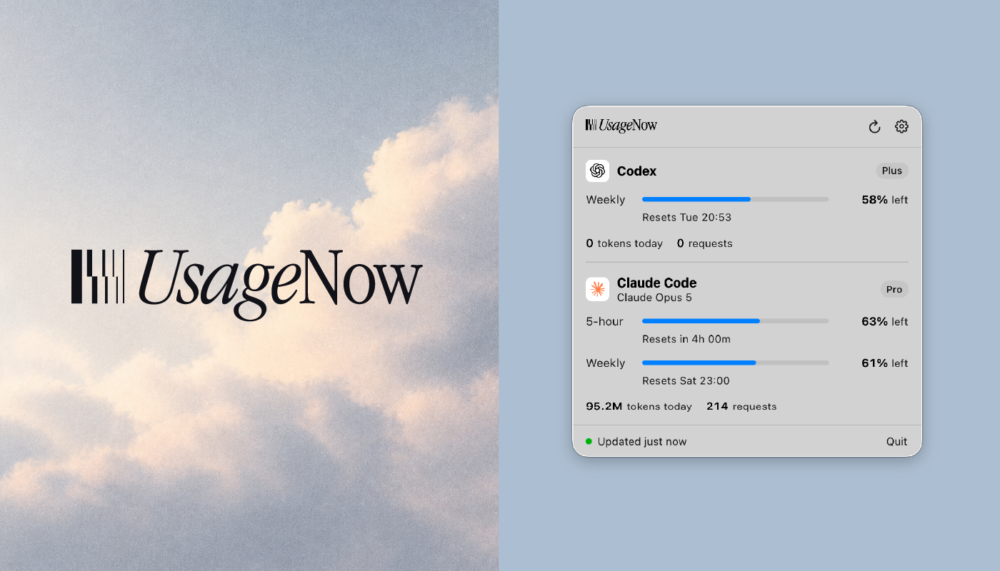

# UsageNow

**AI coding usage tracker for macOS.** Monitor usage, limits, reset times, and token activity across Codex and Claude Code, from the menu bar.

*See what's left. Keep building.*

[usagenow.com](https://usagenow.com) · [Documentation](https://docs.usagenow.com) · [Download](https://github.com/usagenow/usagenow/releases/latest)

## Install

Download **UsageNow-0.2.0.dmg** from [usagenow.com](https://usagenow.com) or the [releases page](https://github.com/usagenow/usagenow/releases), then drag UsageNow to Applications.

A Homebrew cask (`brew install --cask usagenow`) is being submitted and will be listed here once it's accepted.

Requires macOS 15 or later. The app is signed with a Developer ID and notarized by Apple.

## What it reads

UsageNow reads real Codex and Claude Code data from your Mac. Which data is available depends on the tool:

| | Codex | Claude Code |
|---|---|---|
| Usage limits and reset times | ✓ from the official `codex app-server` | ✓ through an experimental, opt-in source (see below) |
| Plan | ✓ | ✓ from Claude Code’s cached account profile |
| Tokens and requests today | ✓ from local session files | ✓ from local session files |
| Most recent model | ✓ | ✓ |

Limit windows are whatever the provider reports. An account may have only a weekly limit, for example, and UsageNow never invents a missing window or shows a fake 0%.

Token and request counts are **local activity** observed in session files on this Mac. They include cached input and don’t necessarily match billing or quota consumption.

## Highlights

- **macOS native.** SwiftUI and `MenuBarExtra`. Lives in the menu bar, not the Dock.
- **Codex + Claude Code** side by side: usage limits, reset times, and daily token and request activity.
- **Pick your providers.** Turn Codex and Claude Code on or off in Settings › Providers. A provider that’s off is never refreshed and never read from disk.
- **Desktop widget.** Small and medium widgets showing what’s left at a glance.
- **Local-first.** Your usage data stays on your Mac.
- **Open source** under the MIT License.
- **No accounts required.**

## Building

Requires macOS 15 or later and Xcode 26 or later.

Clone the repository, open `UsageNow.xcodeproj`, and run the **UsageNow** scheme. The UsageNow symbol appears in the menu bar; click it to open the popover.

From the command line:

```sh
xcodebuild -project UsageNow.xcodeproj -scheme UsageNow build
xcodebuild -project UsageNow.xcodeproj -scheme UsageNow test
```

### Data sources

- **Codex:** limits and plan come from the official Codex CLI’s app-server (`codex app-server`, `account/rateLimits/read`), which UsageNow runs locally. The app-server authenticates itself, so UsageNow never reads Codex credentials. If it’s unavailable, UsageNow falls back to the latest limits recorded in `~/.codex/sessions` and marks them as stale.
- **Claude Code:** activity comes from `~/.claude/projects`, and the plan from `~/.claude.json`. Only timestamps, identifiers, model names, and token counts are extracted. Prompts, responses, and code are never stored, logged, or sent anywhere.
- **Claude usage limits:** experimental and off by default — see below.

UsageNow honors `CODEX_HOME` and `CLAUDE_CONFIG_DIR` when they’re set.

### Claude Code usage limits

Claude Code does not currently expose subscription limits through a supported local API. UsageNow can optionally read the existing Claude Code access token from macOS Keychain and query Anthropic’s usage endpoint. This integration is experimental and may require launching Claude Code in Terminal periodically to refresh your session — the Claude app keeps its own sign-in and doesn’t renew the one in your keychain.

**UsageNow never modifies or stores your Claude Code credentials, and never touches your refresh token.** When the saved sign-in has expired, it asks the Claude Code CLI to renew its own credential — the same delegation used for Codex, where `codex app-server` authenticates itself — and then reads the keychain again. If the CLI isn't installed or can't renew, UsageNow says so and keeps showing local activity.

Turn it on in **Settings › General › Fetch Claude usage limits**. When limits can’t be fetched, UsageNow says why in one line — the session needs refreshing, keychain access was denied, or Anthropic’s endpoint didn’t answer — and keeps showing local token, request, model, and plan data. The last limits it did read stay on screen for a day, marked stale, so a sign-in that expires overnight doesn’t leave an empty panel in the morning.

### Roadmap providers

Gemini CLI, DeepSeek, and Qwen are listed in Settings › Providers as **Coming soon**. They’re labels only: no integration, no credentials, and no network or file access.

## Desktop widget

UsageNow ships a WidgetKit extension with small and medium sizes.

- **Small** is a glance: each enabled provider’s tightest window — the one with the least left — plus the next reset. With a single provider it expands to show the window name and reset time.
- **Medium** gives each provider a column with its windows, remaining percentage, and reset times.
- Disabled providers never appear, quota that isn’t available reads “Usage limits unavailable”, and old data stays visible with an “Updated … ago” note. No placeholder or fabricated values.

**The widget never touches providers.** It can’t read `~/.codex` or `~/.claude`, open the keychain, run `codex app-server`, or call Anthropic. The main app publishes a sanitized snapshot to a shared App Group container, and the widget only renders that. The provider and credential code isn’t compiled into the widget target at all.

### Signing and the widget

The widget reads from an App Group, which needs a signing team. Signing settings live in a git-ignored `Config/Local.xcconfig`:

```sh
cp Config/Local.xcconfig.example Config/Local.xcconfig
# then set DEVELOPMENT_TEAM to your team ID
```

Without it, UsageNow builds ad-hoc and works normally; the widget just shows “Open UsageNow to load usage data.”

### Trying different states

Real providers run by default. For development, mock providers accept a scenario at launch: `normal`, `high`, `critical`, `unavailable`, `notInstalled`, `notAuthenticated`, `failing`, or `loading`.

```sh
open UsageNow.app --args -UsageNowMockCodex critical -UsageNowMockClaude failing
```

The shared scheme includes these as disabled launch arguments, which you can enable under **Product › Scheme › Edit Scheme › Run › Arguments**. SwiftUI previews cover the same states without running the app.

## Architecture

```
Shared/         Code in both the app and the widget: provider catalog,
                usage models, formatters, widget snapshot, widget views
UsageNowWidget/ The extension itself: entry point and timeline provider
UsageNow/
  App/          Entry point and composition root (AppState)
  Domain/       Normalized models: ProviderSnapshot, UsageWindow, UsagePercentage, UsageLevel…
  Providers/    UsageProvider protocol; Codex, Claude Code, and mock providers
  Services/     UsageStore, auto-refresh, launch at login, keychain storage
  Preferences/  User preferences, provider selection, and option types
  Telemetry/    Telemetry events, network client, installation identity, consent
  Features/     MenuBar popover and Settings UI
  Components/   Shared views
  Utilities/    Formatters and app info
```

- **`ProviderCatalog`** is the single source of provider metadata — identifier, display name, artwork, and whether it’s available or on the roadmap.
- **Providers** turn tool-specific data into a normalized `ProviderSnapshot` with any number of usage windows and optional plan, model, and activity. Views depend only on this normalized state and hide data a provider doesn’t have.
- **`UsageStore`** refreshes all providers concurrently. It keeps the last good data when a refresh fails and exposes loading, empty, and per-provider error states.
- **`WidgetSnapshotWriter`** is the only path from provider data to the widget. It drops disabled and not-installed providers, copies each display field explicitly, writes atomically, and reloads timelines only when the content changed.
- **Telemetry** is opt-in and off by default. Clients only receive a small set of events (install, daily active, updated, Codex or Claude Code detected) with the app version, macOS version, and a random installation ID. They never have access to provider data. No analytics server is configured yet, so nothing is sent.

## Contributing

See [CONTRIBUTING.md](CONTRIBUTING.md). To report a security issue, see [SECURITY.md](SECURITY.md).

## License

UsageNow source code is licensed under the MIT License. The UsageNow name, logo, icon, and other brand assets are not covered by the MIT License.

See [LICENSE](LICENSE).
